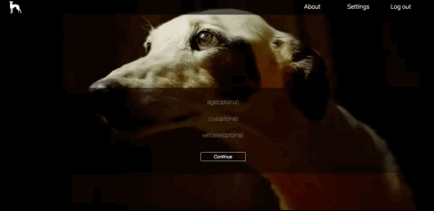

# Petition

## Summary:
A Petition for protecting Spanish Galgos (Greyhounds) from legal tradtitional tortures by hunters in Spain.

## Tech Stack:
* Node.js, express.js
* PostgreSQL Database
* Redis

## Features

* Users registeration and user login

* Users have the option to provide some information about themselves.

* Users can sign the petition using their mouse on the canvas provided.

* Users can see all signers of the petition and can filter the signers by city.

* Users can visit the article that explains the crisis of this tradition followed with images and a short documentary

* Users can edit their information.

* Users can delete their signature and resign from the petition.

* Logout

